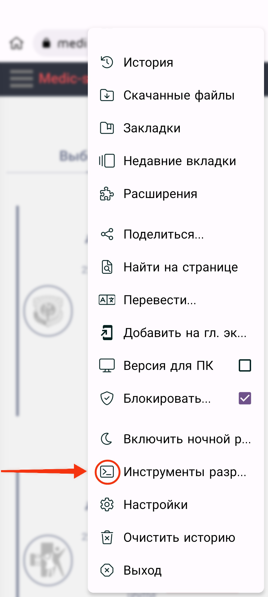
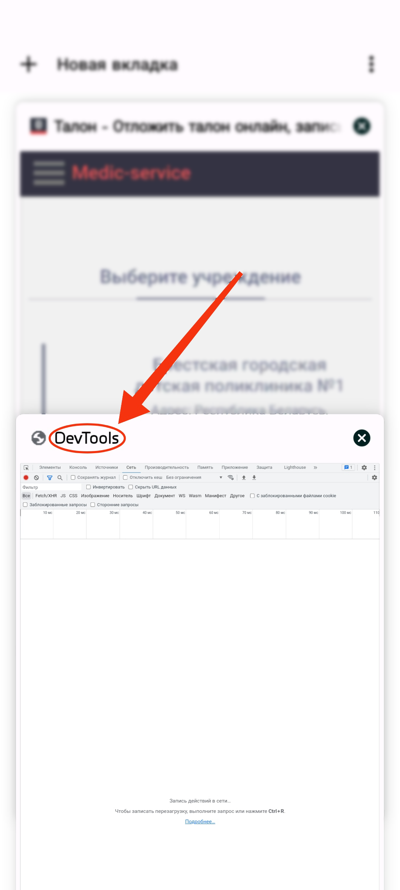
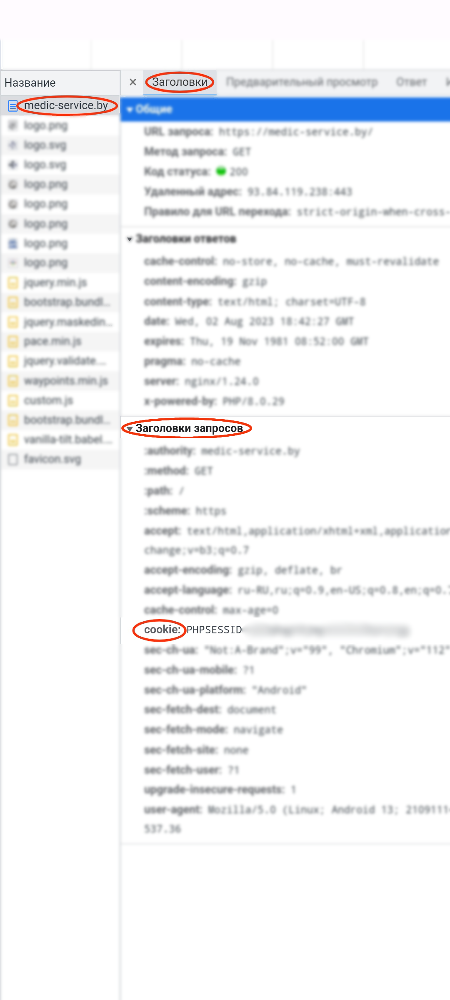

<h1 align="center" id="title">Ticket farmer</h1>

<div align="center">
  
  
  
</div>

<p id="description">Thanks to this script you no longer have to waste time getting a ticket just run main.py and the program will catch the ticket for you. In case of successful finding of the coupon the program will notify you.</p>


## ⚡ Requirements

- Optional Requirements:
  - [Python](https://www.python.org/)
  - [poetry](https://github.com/python-poetry/poetry.git)

## 🛠️ Installation Steps:

### Clone the repository

```shell
git clone https://github.com/twisterraze666/ticket_farmer && cd ticket_farmer
```

### Install dependencies

```shell
poetry install
```

## 📃 Instruction
### 1. Getting PHPSESSID
And so, in order for the script to work correctly, you will need to get your **PHPSESSID**, thanks to which you can safely execute the program without errors with authorization. To get **PHPSESSID** you will have to download the [Kiwi Browser](https://play.google.com/store/apps/details?id=com.kiwibrowser.browser) app.
#### 1.1 Let\`s go to the site [medic-service.by](https://medic-service.by/)
#### 1.2 Go to developer tools.
<p align="left">
  
</p>

#### 1.3 Go to a new tab with name DevTools.

<p align="left">
  
</p>

#### 1.4 Refresh the page [medic-service.by](https://medic-service.by/) 

#### 1.5 Going back to the DevTools tab.
> *Follow the steps in the screenshot.*

<p align="left">
  
</p>

#### 1.6 Copy the PHPSESSID value
> *Click on cookie and click copy value.*


<p align="left">
  
</p>

#### 1.7 After all the manipulations, go to the config.py file.
> *Insert the specified value into the cookie dictionary.*


*file:* **config.py**
```python
COOKIES = {"PHPSESSID": "YOUR_PHPSESSID"}
```
# 🎉 Congratulations! 🎉
> *All you have to do is fill in your data in config.py👌 Good luck! 👋*

# 🔍FAQ
- *How to find out* **ROOM_ID**❓ ✅
> Go to the page to your doctor where coupons are taken and in the url line you will see the **ROOM_ID** parameter passed by the request. 
- *What is this* **project** *anyway*❓ ✅
> This **project** is a script that helps you easily get medical *tickets* without the need to manually get a *ticket* from the [medic-service.by](https://medic-service.by/)
- *Who is the* **project** *for*❓ ✅
> The **project** was created for the country of Belarus, but can also be used by other **CIS** countries using [medic-service.by](https://medic-service.by/) to receive *tickets*.
